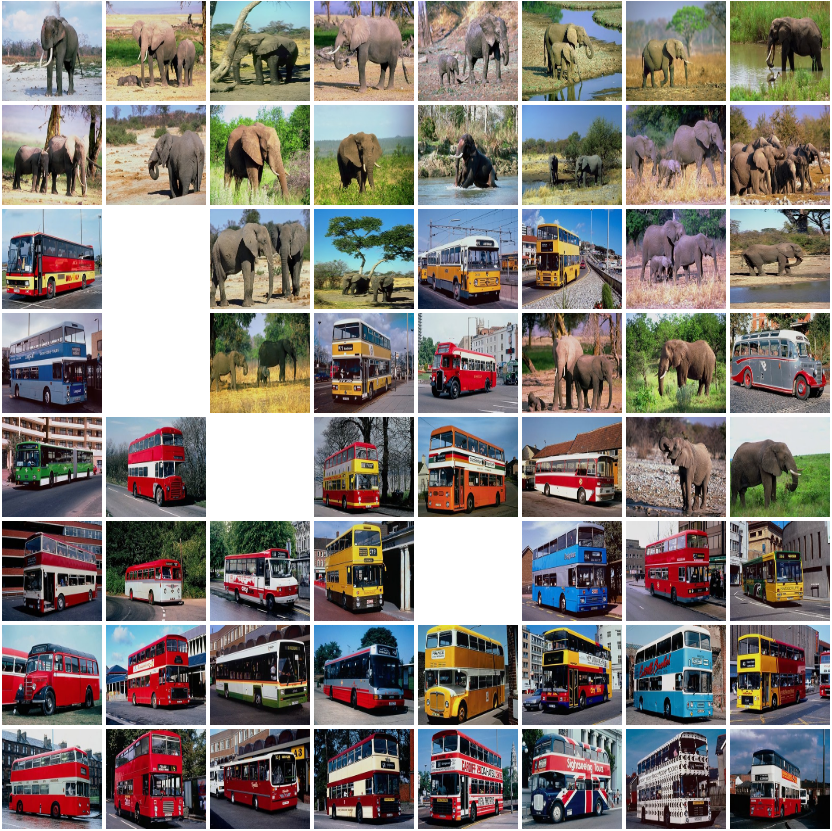
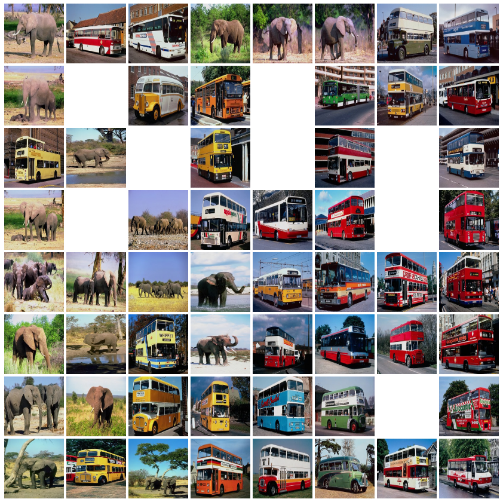
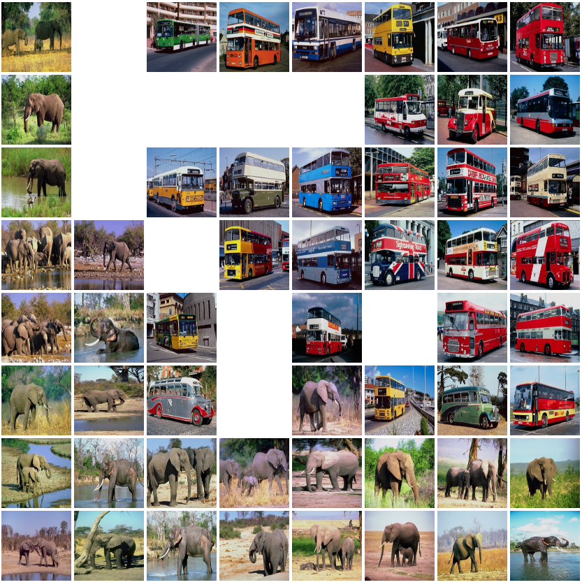
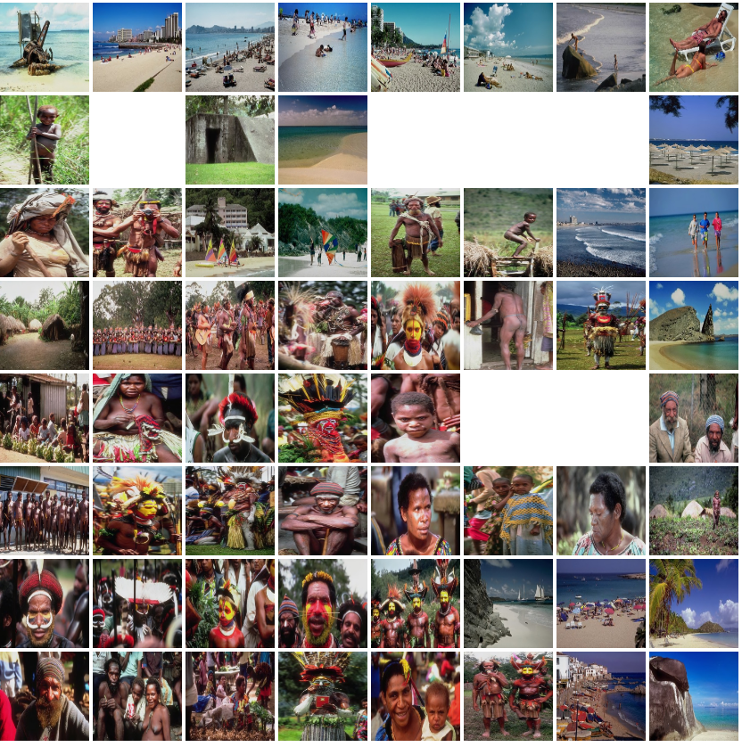
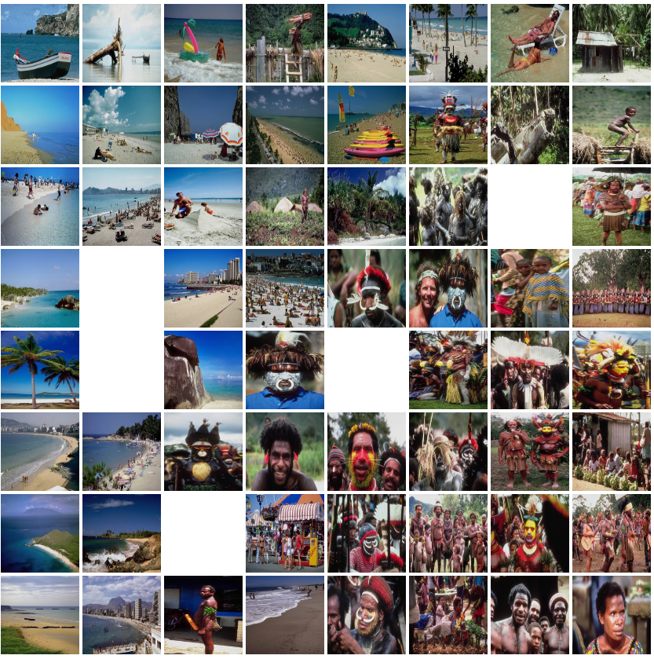
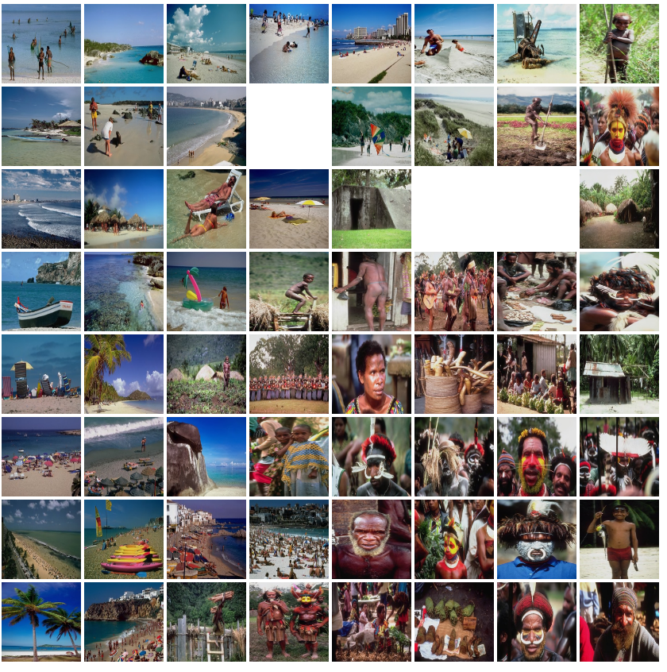
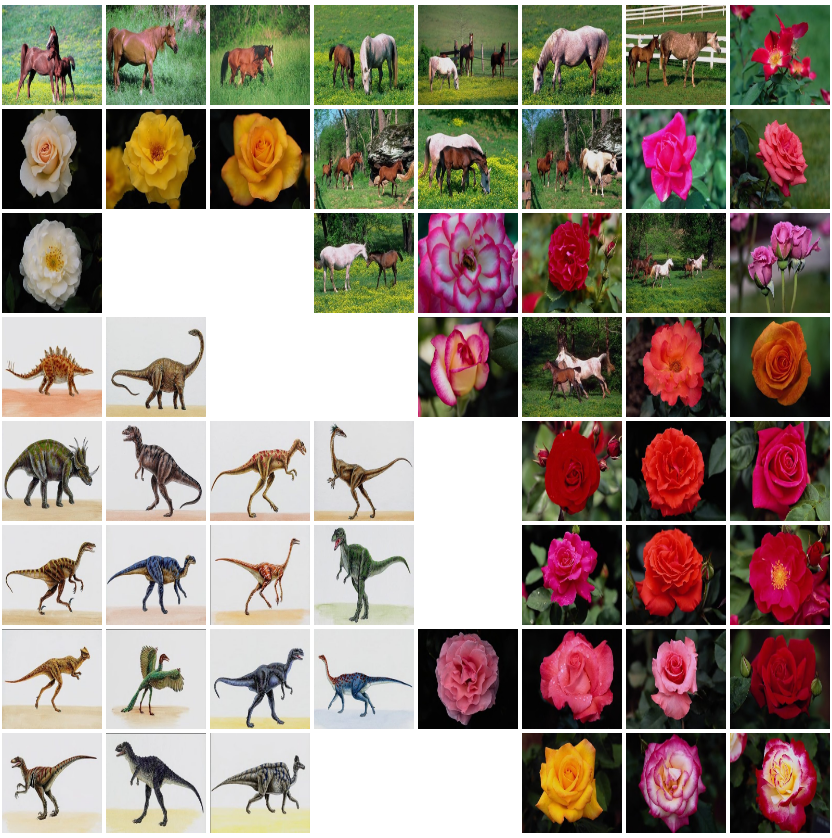
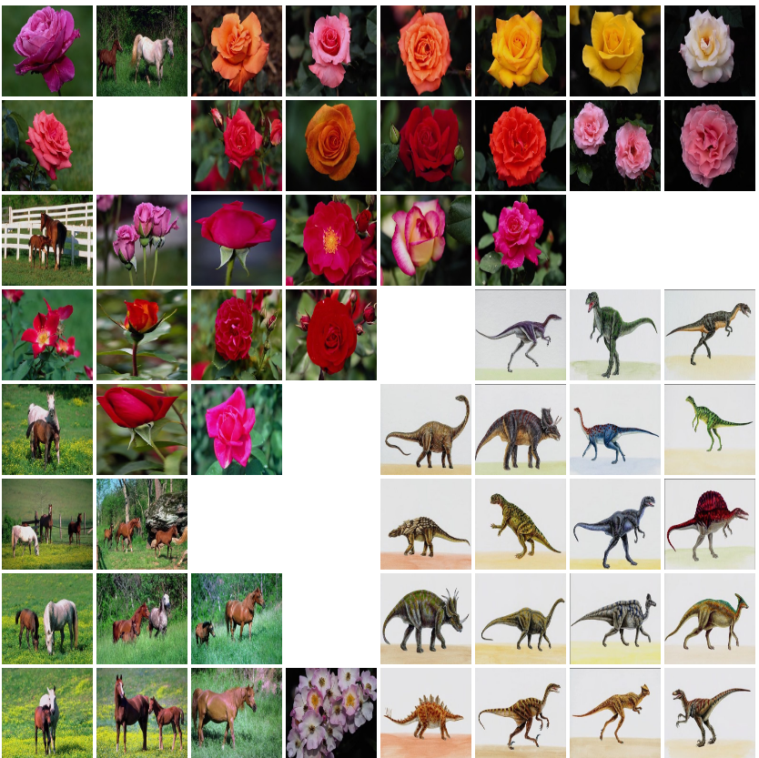
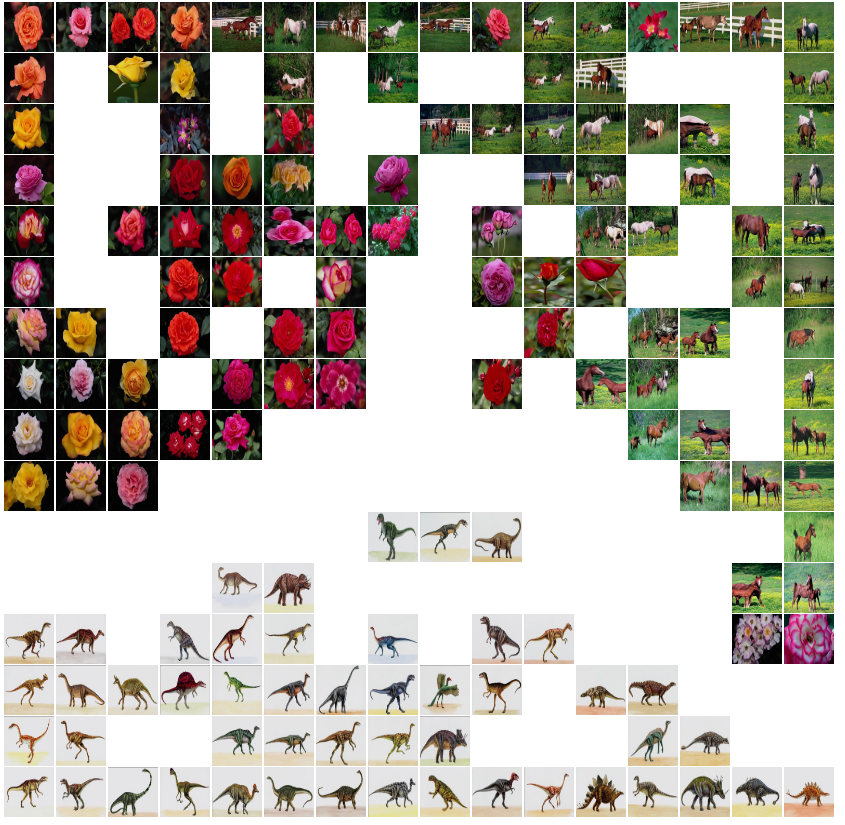

# Laboratoire MLG 5

> Gabriel Roch, Jérôme Arn

## Partie 1 - Exercice 1

<p style="background-color:#006600; color:#fff;padding:5px; font-weight:bold">Q: Analyze the code (in KohonenUtils.py) to understand what are the uses of each block in the cell right above.</p>

KohonenUtils.KohonenMap : permet de définir le nombre de neurones qui sont sur la map ainsi que le nombre de dimensions d'entrée (ou autrement dis le nombre de features).

ExponentialTimeSeries sert à modifier le **learning rate** ainsi que le **neighborhood_size**. Ces deux paramètres décroissent au fur et à mesure que les itérations avancent.

<p style="background-color:#006600; color:#fff;padding:5px; font-weight:bold">Q: What do you think about the clustering quality ? </p>

La qualité est relativement bonne, on voit qu'il effectue une première séparation entre les animaux à deux et quatre pattes.

De même, on voit qu'il sépare bien les animaux ayant des tailles bien différentes (lion-chien, chat-tigre par exemple). On remarque aussi que celui-ci, avec les features qu'on lui a données, ne distingue pas un cheval d'un zèbre.


<p style="background-color:#006600; color:#fff;padding:5px; font-weight:bold">Q: We plotted the U-Matrix in the previous cell. What does it represent ? </p>

La proximité des différents points ainsi que la représentation des clusters trouvés par le modèle.


<p style="background-color:#006600; color:#fff;padding:5px; font-weight:bold">Q: What do the small stars represent ? What do the bigger circles represent ? </p>

Les étoiles représentent les neurones et les ronds les bordures de voisinage.


<p style="background-color:#006600; color:#fff;padding:5px; font-weight:bold">Q: What does the color in the big circles mean ? </p>

Plus la couleur tend vert le noir, plus la séparation est marquée.


<p style="background-color:#006600; color:#fff;padding:5px; font-weight:bold">Q: What does the color in the small stars mean ? </p>

Une étoile bleue implique un neurone non-utilisé alors qu'une rouge implique une observation du dataset.


<p style="background-color:#006600; color:#fff;padding:5px; font-weight:bold">Q: Plot the learning rate and the neighborhood size. Why do you think we choose them like this? </p>

Cela indique que l'on fait des modifications grossières au début pour s'adapter au dataset et plus le temps avance, plus les modifications se font finement.

## Partie 1 - Exercice 2

<p style="background-color:#006600; color:#fff;padding:5px; font-weight:bold">Q: Observe the animals that are grouped together by K-Means and try different numbers of clusters: K=2,3,4, etc. </p>

Pour K = 2, on obtient les clusters suivant:

```
['dove', 'hen', 'duck', 'goose', 'tiger', 'lion', 'horse', 'zebra', 'cow']
['owl', 'hawk', 'eagle', 'fox', 'dog', 'wolf', 'cat']
```

Pour K = 3, on obtient les clusters suivant:

```
['fox', 'dog', 'cat', 'tiger', 'cow']
['dove', 'hen', 'duck', 'goose', 'owl', 'hawk', 'eagle']
['wolf', 'lion', 'horse', 'zebra']
```

Pour K = 4, on obtient les clusters suivant:

```
['dove', 'hen', 'duck', 'owl', 'hawk', 'eagle']
['horse', 'zebra', 'cow']
['fox', 'dog', 'wolf', 'cat', 'tiger', 'lion']
['goose']
```

Pour K = 5, on obtient les clusters suivant:

```
['tiger', 'lion', 'horse', 'zebra', 'cow']
['fox', 'dog', 'wolf']
['duck', 'goose']
['dove', 'hen', 'owl', 'hawk', 'eagle']
['cat']
```

On remarque que plus on augmente la taille de cluster, plus ils ont de sense en terme de logique. Pour K= 5, on peut dire que la séparation entre les animaux à quatre pattes et ceux à deux pattes fait sens. Mais la différence entre les oiseaux semblent difficile à comprendre en terme de taille.

<p style="background-color:#006600; color:#fff;padding:5px; font-weight:bold">Q: n_init is a parameter that automatically asks K-means to try different cluster initializations and selects the best result. init='random' asks K-means to randomly initialize the cluster centroids. Please, try init=’k-means++’ and modify n_init to 10 for example and observe the results. </p>

Pour K = 2, on obtient les clusters suivant:
```
['fox', 'dog', 'wolf', 'cat', 'tiger', 'lion', 'horse', 'zebra', 'cow']
['dove', 'hen', 'duck', 'goose', 'owl', 'hawk', 'eagle']
```

Pour K = 3, on obtient les clusters suivant:
```
['fox', 'dog', 'wolf', 'cat']
['dove', 'hen', 'duck', 'goose', 'owl', 'hawk', 'eagle']
['tiger', 'lion', 'horse', 'zebra', 'cow']
```

Pour K = 4, on obtient les clusters suivant:
```
['fox', 'dog', 'wolf', 'cat', 'tiger', 'lion']
['dove', 'owl', 'hawk', 'eagle']
['horse', 'zebra', 'cow']
['hen', 'duck', 'goose']
```

Pour K = 5, on obtient les clusters suivant:
```
['tiger', 'lion']
['owl', 'hawk', 'eagle']
['dove', 'hen', 'duck', 'goose']
['fox', 'dog', 'wolf', 'cat']
['horse', 'zebra', 'cow']
```

Pour K = 7, on obtient les clusters suivant:
```
['horse', 'zebra', 'cow']
['dove', 'owl', 'hawk', 'eagle']
['fox', 'cat']
['goose']
['tiger', 'lion']
['dog', 'wolf']
['hen', 'duck']
```

On peut remarquer une séparation plus logique entre les animaux (taille, nombre de pattes,  animaux volant, etc.)

## Partie 1 - Exercice 3

<p style="background-color:#006600; color:#fff;padding:5px; font-weight:bold">Q: Observe the observations that are grouped together by K-Means. </p>

On peut remarquer que le modèle attribue bien des classes aux vins mais qu'elles ne correspondent pas au classe utilisée pour labellisés les vins.  

<p style="background-color:#006600; color:#fff;padding:5px; font-weight:bold">Q: Count the number of "bottles" that are correctly grouped. What is the accuracy of this unsupervised classification? </p>

Quoi qu'il arrive, nous avons toujours 125 bouteilles qui sont correctement catégorisé. Cela fait une précision d'environ 70%.

<p style="background-color:#006600; color:#fff;padding:5px; font-weight:bold">Q: Try to improve the performance of the classification. Does normalizing the data increases the accuracy? Does selecting a reduced number of features improves the accuracy? Why?. </p>

En choisissant certaines colonnes, comme `alcohol` et   `flavanoids`, on arrive à obtenir une précision de 89.3%. Nous avons choisit ces critères sur la base des boîtes à moustaches du premier travaux pratique.

Si on fait une normalisation uniquement de ces deux colonnes on peut avoir jusqu'à 90.4% de précision. En faisant une normalisation de toutes les colonnes, notre précision grimpe jusqu'à 96,6 %.


##  Partie 2

<p style="background-color:#006600; color:#fff;padding:5px; font-weight:bold">Q: Explain the three different methods we provided for extracting features. What do you understand about them (input, output), how do they work ? </p>

Les trois méthodes prennent par défaut un paramètre **bins** par défaut à 10 qui représente la résolution de l'histogramme retourné.

- Méthode **extract_histogram**: Effectue un histogramme sur les teintes de gris de l'image. la fonction retourne un  histogramme de l'image .
- Méthode **extract_hue_histogram**: Effectue un histogramme sur la teinte de l'image. la fonction retourne un histogramme de l'image .
- Méthode **extract_color_histogram**: Effectue un histogramme sur les couleurs de l'image. la fonction retourne trois histogrammes de chaque couleur de l'image.

### Bus vs éléphants

Pour cette partie nous avons laissé les paramètres de bases qui nous étaient donnés.

**Features niveaux de gris**

Pour séparer efficacement des bus et des éléphants, le niveaux de gris ne présente pas séparation nette. Suivant la couleur du bus, en particulier jaune et gris, on peut facilement avoir un mélange.



**Features teinte**

Cette feature ne sépare pas du tout les datasets. Nous retrouvons des éléphants au milieu des bus.



**Features en fonctions des couleurs primaires**

En utilisant la couleur, il nous semble que nous avons la séparation la plus nette pour les deux datasets parmi les méthodes utilisées. Cela dépend évidemment de la couleur du bus et de l'arrière plan.



### Plage vs Personne
Pour cette partie nous avons laissé les paramètres de bases qui nous étaient donnés.

**Features niveaux de gris**

La distinction s'effectue de manière correct lorsque les personnes sont en gros plan et que la plage présente un ciel bleu et une plage blanche. Si l'image de plage est plus sombre, on a quelque confusion.



**Features teinte**

Cette image présente les même avantages/désavantages que l'image précédente mais néanmoins il y a un léger avantage a utilisé cette feature.



**Features en fonctions des couleurs primaires**

À notre avis, cette feature effectue la meilleure distinction entre les deux datasets.




### Dinosaures vs fleures vs chevaux
Pour cette partie nous avons modifié juste le paramètres bins de chaque fonctions d'extraction de features avec une valeur de 50.

**Features niveaux de gris**

On remarque que pour les dinosaures la séparation est très nette. En revanche entre les chevaux et les fleurs, il y a un mélange. 



**Features en fonctions des couleurs primaires**

On remarque une légère amélioration dans la séparation entre chevaux et fleurs, bien que cela ne soit pas encore très nette.



Pour cette image nous avons changé la taille de la map avec une taille de 16x16. Nous remarquons une plus forte séparation entre l'image ci-dessus et l'image ci-dessous. Néanmoins on remarque que les chevaux et les fleurs ont de la peine à être séparés de manière nette. de manière générale, les dinosaures sont séparés de manière assez nette par toutes les features tandis que les deux autres datasets sont difficilement séparable quelque soit la taille de la map ou la features.

**Features en fonctions des couleurs primaires avec map de 16 par 16** 


